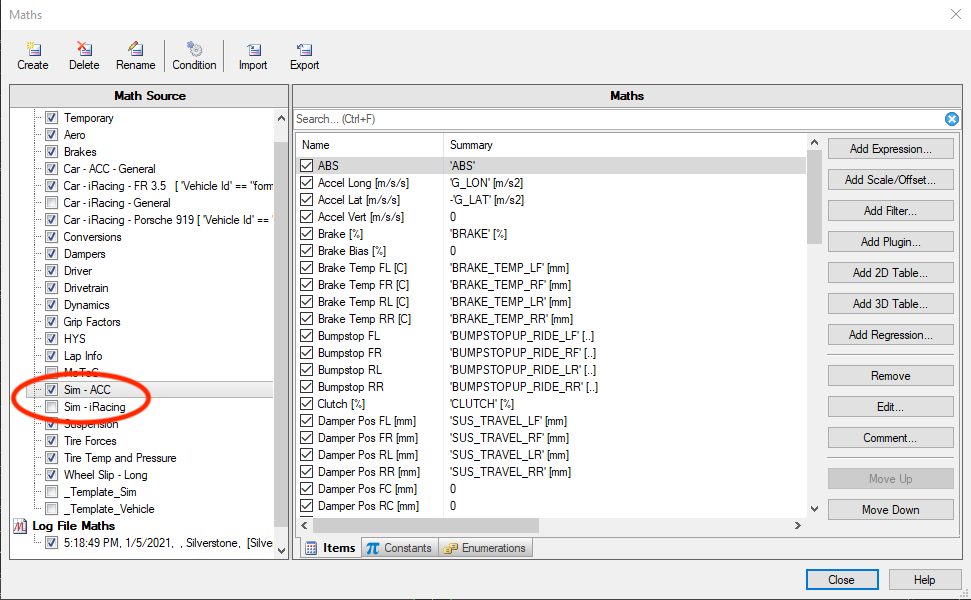

# SDMotecWorkspace

This is a MoTeC workspace configured to accept multiple data sources and provide an assortment of calculations for vehicle dynamics and performance.

## Setup Instructions

1. Make sure you have [MoTeC i2 Pro](https://www.motec.com.au/i2/i2downloads/) installed
1. Go to the [Releases page](https://github.com/stevendaniluk/SDMotecWorkspace/releases) and download the ZIP file for the latest release (or if you are familiar with git, do your thing)
1. Unzip the downloaded file, and change the name removing the version number that gets appended because MoTeC can't handle "." characters (e.g. change it to *SDMotecWorkspace*)
1. Open MoTeC, go *File-->Workspace-->Open Workspace*, then select *Import*, navigate to the downloaded folder and select the *Workspace* file inside, this will import it into MoTeC for future use
1. Select the *SDMotecWorkspace* workspace, then *OK* to open the workspace
1. Navigate to the *Notes* workbook for further instructions

*Note: If using iRacing you will also need to install [Mu Telementry Exporter](https://github.com/patrickmoore/Mu) to generate MoTeC log files.*

## Features

### Support For Multiple Data Sources

The workspace is setup so that data can be easily analyzed from different sources (i.e. vehicles, simulators) without having to use different workspces. Meaning all the same calulcations and plots can be reused, and data is always available with the same units, colours, and coordinate conventions.

Source specific conversions are enabled/disabled by checking/unchecking the corresponding maths file in the *Maths Editor* (Ctrl + M). There are more instructions and details in the *Notes* workbook.

You can easily add your own car or simulator from the provided template file. This currently includes math files for the ACC and iRacing simulators.

### Calculations

A non exhaustive list of calculations:
* Driver Input:
   * Throttle application and release rate (instantaneous and lap average)
   * Brake application and release rate (instantaneous and lap average)
   * Steering rate (instantaneous and lap average)
* Dynamics:
   * Oversteer angle
   * Wheel angle and curvature from driver input and estimated from vehicle motion
   * Total acceleration during various phases (braking, cornering, aero dominated)
   * Tire slip angle (all corners, accounting for steering input and toe angles)
   * Tire longitudnal slip
   * Actively loaded tire durations
* Suspension:
   * Damper velocity histograms
   * Ride height
   * Rake angle
   * Front and rear roll angles
   * Front and rear roll gradients
   * Roll ratio (instantaneous and lap average)
* Tires, Brakes, and Drivetrain:
   * Change in temperature and pressure over a lap and stint
   * Tire temperature bias
   * Tire pressure bias
   * Brake temperature rates
   * Brake temperature bias (front/rear)
   * Gear usage
   * Fuel consumption rate
* Hybrid System:
   * Battery charge percentage (instantaneous and lap average)
   * Battery usage and charge rates
   * Power deployed and recovered
   * Braking regeneration efficienty
* Conditions:
   * Active gear
   * Cornering, not cornering
   * Braking, WOT, half WOT, etc

Below are some sample images from various worksheets.

Oversteer during a lap and a track map showing the areas most prone to understeer/oversteer, and how the oversteer evolves over an entire stint.

Tire slip angle and its relationship with lateral tire force to determine when you are getting the most out of the tires.

Damper position data can be used to extract the ride heights, rake angle, and roll angle. Roll rates are a vaulable metric for assessing vehicle balance.

Hybrid system energy usage and regeneration efficiency. You can monitor how the hybrid system battery level changes over a lap, over the race, and how the charge rate changes as a function of braking input.

## Version History

* **1.1.0**
   * Minor update with a few additional channels, calculations, bug fixes, and additional track and vehicle info.
* **1.0.0**
   * Initial version. Has support for ACC and iRacing outputs, general purpose cars for ACC and iRacing, and some sample cars from iRacing.
